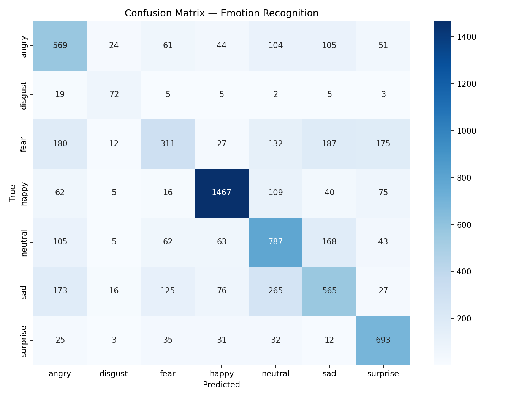

# Emotion Recognition AI

Real-time facial emotion recognition system built with a transfer-learning CNN, complete with explainability, a live in-browser webcam demo, and a deployed REST API.

**🎥 Try it live: https://emotion-ai-3r0y.onrender.com/demo**
**📄 API docs: https://emotion-ai-3r0y.onrender.com/docs**

*(Hosted on Render's free tier — first request after inactivity may take 30-60s to wake up.)*

---

## Overview

This project classifies facial expressions into 7 emotions — **angry, disgust, fear, happy, neutral, sad, surprise** — using a MobileNetV2 backbone fine-tuned on FER2013. Beyond training a classifier, this project focuses on the parts that separate a research prototype from something production-aware:

- Two-phase transfer learning (frozen head → selective fine-tuning)
- Rigorous per-class evaluation, not just headline accuracy
- Grad-CAM explainability to understand *why* the model gets things wrong
- A real-time webcam demo — both a local Python version and a **live in-browser version**
- A deployed FastAPI backend anyone can call

## Results

| Metric | v1 (baseline) | v2 (tuned) |
|---|---|---|
| Val Accuracy | 54.8% | **62.2%** |
| Macro F1 | 0.492 | **0.593** |

**Per-class F1 (v2):**

| Emotion | F1 Score |
|---|---|
| Happy | 0.841 |
| Surprise | 0.730 |
| Disgust | 0.581 |
| Neutral | 0.591 |
| Sad | 0.485 |
| Angry | 0.544 |
| Fear | 0.379 |



Fear remains the hardest class — it's visually confusable with angry, sad, and surprise (subtle brow/eye tension overlaps across all four), and FER2013's fear labels are known to be some of the noisiest in the dataset. See [Explainability](#explainability) for a visual breakdown of why.

## Explainability (Grad-CAM)

Grad-CAM visualizations show *where* the model looks when making a prediction — this revealed a concrete, fixable insight: the model over-relies on eyebrow/eye regions and under-weights mouth shape, causing some genuinely happy expressions (big smiles) to get misclassified as surprise when eyebrows are also raised.


## Live Demo

The `/demo` endpoint runs entirely in-browser: it accesses your webcam via `getUserMedia`, streams frames to the deployed `/predict` API roughly every 800ms, and draws a live bounding box + emotion label overlay on canvas. No installation required.

## Architecture

Input Image → MediaPipe Face Detection → Face Crop (5% padding)
→ MobileNetV2 (60 layers fine-tuned) → Dense Head → Softmax (7 classes)

- **Backbone**: MobileNetV2, ImageNet-pretrained, transfer-learned in two phases
  - Phase 1: frozen backbone, train classification head (15 epochs)
  - Phase 2: unfreeze top 60 layers, fine-tune end-to-end (35 epochs)
- **Face detection**: MediaPipe Face Detection
- **Training**: class-weighted loss to handle FER2013's imbalance (disgust is ~9x rarer than happy)


## Setup

### Training environment (GPU, via WSL2)

```bash
python -m venv venv-wsl
source venv-wsl/bin/activate
pip install tensorflow[and-cuda]==2.15.0.post1
pip install opencv-python mediapipe scikit-learn matplotlib seaborn kaggle
```

### Dataset

```bash
kaggle datasets download -d msambare/fer2013
unzip fer2013.zip -d data/raw
```

### Train

```bash
python src/train_v2.py
```

### Evaluate

```bash
python src/evaluate.py
python src/gradcam.py
```

### Run the local Python webcam demo (Windows, native — not WSL)

```bash
python -m venv venv
venv\Scripts\activate
pip install -r requirements.txt
python src/webcam_demo.py
```

### Run the API + browser demo locally

```bash
uvicorn app.main:app --reload
```

Visit `http://localhost:8000/demo` for the live browser demo, or `http://localhost:8000/docs` for the API reference.

## API Usage

```bash
curl -X POST "https://emotion-ai-3r0y.onrender.com/predict" \
  -F "file=@your_image.jpg"
```

Response:
```json
{
  "faces_detected": 1,
  "results": [
    {
      "emotion": "happy",
      "confidence": 0.87,
      "bounding_box": {"x1": 120, "y1": 80, "x2": 340, "y2": 300},
      "all_probabilities": { "angry": 0.01, "disgust": 0.00, "...": "..." }
    }
  ]
}
```

## Key Technical Decisions & Learnings

- **Two-phase fine-tuning matters**: unfreezing more layers (20→60) and training longer (20→35 epochs) improved macro-F1 from 0.492 to 0.593 — every single class improved, not just the easy ones.
- **Face crop padding must match training distribution**: FER2013 images are tightly cropped; adding 20% padding in the live webcam demo actually *hurt* confidence by pushing inputs away from the training distribution. Reducing to 5% fixed it.
- **Native WSL disk vs. Windows mount matters for training speed**: reading FER2013 from a Windows-mounted drive (`/mnt/t/`) in WSL2 caused ~15 min/epoch; copying the dataset to native WSL disk cut this to ~4-5 min/epoch.
- **Grad-CAM is diagnostic, not just decorative**: it directly explained *why* fear/angry/sad get confused (overlapping brow/eye signals) — a finding grounded in visual evidence, not speculation.
- **Free-tier deployment forces lean engineering**: Render's 512MB RAM cap meant trimming dependencies (a separate `requirements-api.txt` dropping matplotlib/seaborn/kaggle, swapping `tensorflow`→`tensorflow-cpu` and `opencv-python`→`opencv-python-headless`) — a good constraint for thinking about production footprint, not just accuracy.

## Limitations

- Trained on FER2013 alone (48x48-native, resized to 224x224) — a dataset with known label noise and skew toward certain demographics/lighting conditions; accuracy on out-of-distribution faces (different lighting, angles, occlusion) will be lower than the 62.2% benchmark.
- Fear detection is weak (37.9% F1) — a known hard class in FER-family datasets.
- Deployed API runs on Render's free tier (512MB RAM, spins down after 15 min idle) — not suitable for production traffic, but sufficient for demo purposes.

## Author
Tanmay Singh


## License

MIT
